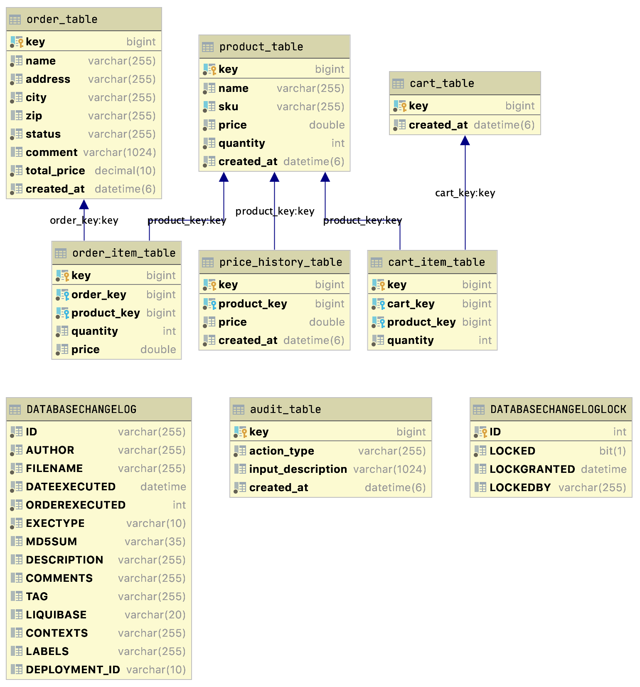

# ICommerce


 

 


A simple eCommerce Application with Spring Boot API.

## Table of Contents
- [Features](#features) 
- [Get started](#getstarted)
- [Documentation](#documentation)
- [Tools](#tools) 
- [License](#license)

## Features 
- Product Management
- Cart Management
- Order Management

## Get started

You can clone this repository and use it localy:
```sh
$ git clone https://github.com/phuongleit89/ICommerce.git
```

**Run the Application**
```bash
./gradlew bootRun
```

The application will start on port `8080` so you can send a sample request to `http://localhost:8080/actuator/health/` to see if you're up and running.

## Documentation

## Database Relationship Diagram



For the Swagger UI
```bash
http://localhost:8080/swagger-ui/
``` 

### /cart
#### POST
##### Responses
| Code | Description | Schema |
| ---- | ----------- | ------ |
| 200 | OK | [CartResponse](#cartresponse) |
| 201 | Created |  |
| 401 | Unauthorized |  |
| 403 | Forbidden |  |
| 404 | Not Found |  |
---
### /cart/{key}
#### GET
##### Parameters
| Name | Located in | Description | Required | Schema |
| ---- | ---------- | ----------- | -------- | ---- |
| key | path | key | Yes | long |
 ---
##### Responses
| Code | Description | Schema |
| ---- | ----------- | ------ |
| 200 | OK | [CartResponse](#cartresponse) |
| 401 | Unauthorized |  |
| 403 | Forbidden |  |
| 404 | Not Found |  |
---
#### PUT
##### Parameters
| Name | Located in | Description | Required | Schema |
| ---- | ---------- | ----------- | -------- | ---- |
| cartItem | body | cartItem | Yes | [CartItemRequest](#cartitemrequest) |
| key | path | key | Yes | long |
##### Responses
| Code | Description | Schema |
| ---- | ----------- | ------ |
| 200 | OK | [CartResponse](#cartresponse) |
| 201 | Created |  |
| 401 | Unauthorized |  |
| 403 | Forbidden |  |
| 404 | Not Found |  |
---
### /cart/{key}/quantity
#### PUT
##### Parameters
| Name | Located in | Description | Required | Schema |
| ---- | ---------- | ----------- | -------- | ---- |
| cartItem | body | cartItem | Yes | [CartItemRequest](#cartitemrequest) |
| key | path | key | Yes | long |
##### Responses
| Code | Description | Schema |
| ---- | ----------- | ------ |
| 200 | OK | [CartResponse](#cartresponse) |
| 201 | Created |  |
| 401 | Unauthorized |  |
| 403 | Forbidden |  |
| 404 | Not Found |  |
---
### /cart/{key}/{product_key}
#### DELETE
##### Parameters
| Name | Located in | Description | Required | Schema |
| ---- | ---------- | ----------- | -------- | ---- |
| key | path | key | Yes | long |
| product_key | path | product_key | Yes | long |
##### Responses
| Code | Description | Schema |
| ---- | ----------- | ------ |
| 200 | OK | [CartResponse](#cartresponse) |
| 204 | No Content |  |
| 401 | Unauthorized |  |
| 403 | Forbidden |  |
---
### /order/create/{card_key}
#### POST
##### Parameters
| Name | Located in | Description | Required | Schema |
| ---- | ---------- | ----------- | -------- | ---- |
| card_key | path | card_key | Yes | long |
| order | body | order | Yes | [OrderRequest](#orderrequest) |
##### Responses
| Code | Description | Schema |
| ---- | ----------- | ------ |
| 200 | OK | [OrderResponse](#orderresponse) |
| 201 | Created |  |
| 401 | Unauthorized |  |
| 403 | Forbidden |  |
| 404 | Not Found |  |
---
### /order/{key}
#### GET
##### Parameters
| Name | Located in | Description | Required | Schema |
| ---- | ---------- | ----------- | -------- | ---- |
| key | path | key | Yes | long |
##### Responses
| Code | Description | Schema |
| ---- | ----------- | ------ |
| 200 | OK | [OrderResponse](#orderresponse) |
| 401 | Unauthorized |  |
| 403 | Forbidden |  |
| 404 | Not Found |  |
---
### /order/{key}/status
#### PUT
##### Parameters
| Name | Located in | Description | Required | Schema |
| ---- | ---------- | ----------- | -------- | ---- |
| key | path | key | Yes | long |
| statusRequest | body | statusRequest | Yes | [OrderStatusRequest](#orderstatusrequest) |
##### Responses
| Code | Description | Schema |
| ---- | ----------- | ------ |
| 200 | OK | [OrderResponse](#orderresponse) |
| 201 | Created |  |
| 401 | Unauthorized |  |
| 403 | Forbidden |  |
| 404 | Not Found |  |
---
### /product/add
#### POST
##### Parameters
| Name | Located in | Description | Required | Schema |
| ---- | ---------- | ----------- | -------- | ---- |
| productRequest | body | productRequest | Yes | [ProductRequest](#productrequest) |
##### Responses
| Code | Description | Schema |
| ---- | ----------- | ------ |
| 200 | OK | [ProductResponse](#productresponse) |
| 201 | Created |  |
| 401 | Unauthorized |  |
| 403 | Forbidden |  |
| 404 | Not Found |  |
---
### /product/search
#### GET
##### Parameters
| Name | Located in | Description | Required | Schema |
| ---- | ---------- | ----------- | -------- | ---- |
| maxPrice | query | maxPrice | No | double |
| maxQuantity | query | maxQuantity | No | integer |
| minPrice | query | minPrice | No | double |
| minQuantity | query | minQuantity | No | integer |
| name | query | name | No | string |
| page | query | page | No | integer |
| size | query | size | No | integer |
| sku | query | sku | No | string |
| sort | query | sort | No | [ string ] |
##### Responses
| Code | Description | Schema |
| ---- | ----------- | ------ |
| 200 | OK | [ProductPageResults](#productpageresults) |
| 401 | Unauthorized |  |
| 403 | Forbidden |  |
| 404 | Not Found |  |
---
### /product/{key}
#### GET
##### Parameters
| Name | Located in | Description | Required | Schema |
| ---- | ---------- | ----------- | -------- | ---- |
| key | path | key | Yes | long |
##### Responses
| Code | Description | Schema |
| ---- | ----------- | ------ |
| 200 | OK | [ProductResponse](#productresponse) |
| 401 | Unauthorized |  |
| 403 | Forbidden |  |
| 404 | Not Found |  |
---
#### PUT
##### Parameters
| Name | Located in | Description | Required | Schema |
| ---- | ---------- | ----------- | -------- | ---- |
| key | path | key | Yes | long |
| productRequest | body | productRequest | Yes | [ProductRequest](#productrequest) |
##### Responses
| Code | Description | Schema |
| ---- | ----------- | ------ |
| 200 | OK | [ProductResponse](#productresponse) |
| 201 | Created |  |
| 401 | Unauthorized |  |
| 403 | Forbidden |  |
| 404 | Not Found |  |

### Models

#### CartItemRequest
| Name | Type | Description | Required |
| ---- | ---- | ----------- | -------- |
| productKey | long |  | Yes |
| quantity | integer |  | Yes |

#### CartItemResponse
| Name | Type | Description | Required |
| ---- | ---- | ----------- | -------- |
| product | [ProductResponse](#productresponse) |  | No |
| quantity | integer |  | No |

#### CartResponse
| Name | Type | Description | Required |
| ---- | ---- | ----------- | -------- |
| cartItems | [ [CartItemResponse](#cartitemresponse) ] |  | No |
| key | long |  | No |

#### OrderItemResponse
| Name | Type | Description | Required |
| ---- | ---- | ----------- | -------- |
| price | double |  | No |
| product | [ProductResponse](#productresponse) |  | No |
| quantity | integer |  | No |

#### OrderRequest
| Name | Type | Description | Required |
| ---- | ---- | ----------- | -------- |
| address | string |  | Yes |
| city | string |  | Yes |
| comment | string |  | Yes |
| name | string |  | Yes |
| zip | string |  | No |

#### OrderResponse
| Name | Type | Description | Required |
| ---- | ---- | ----------- | -------- |
| address | string |  | No |
| city | string |  | No |
| comment | string |  | No |
| key | long |  | No |
| name | string |  | No |
| orderItems | [ [OrderItemResponse](#orderitemresponse) ] |  | No |
| status | string | _Enum:_ `"CANCELED"`, `"DELIVERING"`, `"FINISHED"`, `"INITIATE"`, `"PROCESSING"` | No |
| totalPrice | number |  | No |
| zip | string |  | No |

#### OrderStatusRequest
| Name | Type | Description | Required |
| ---- | ---- | ----------- | -------- |
| status | string | _Enum:_ `"CANCELED"`, `"DELIVERING"`, `"FINISHED"`, `"INITIATE"`, `"PROCESSING"` | Yes |

#### ProductPageResults
| Name | Type | Description | Required |
| ---- | ---- | ----------- | -------- |
| currentPage | integer |  | No |
| products | [ [ProductResponse](#productresponse) ] |  | No |
| totalItems | long |  | No |
| totalPages | integer |  | No |

#### ProductRequest
| Name | Type | Description | Required |
| ---- | ---- | ----------- | -------- |
| name | string |  | Yes |
| price | double |  | Yes |
| quantity | integer |  | Yes |
| sku | string |  | Yes |

#### ProductResponse
| Name | Type | Description | Required |
| ---- | ---- | ----------- | -------- |
| key | long |  | No |
| name | string |  | No |
| price | double |  | No |
| quantity | integer |  | No |
| sku | string |  | No |

## Tools
  * **Spring Boot**: Application Framework
  * **Liquibase**: Management of Database changes
  * **Spring AOP**: Modularization for audit customer activities
  * **Spring JPA**: Implementation of data access layers
  * **Hibernate Validator**: Validate domain objects
  * **MySQL**: MySQL database
  * **Swagger2**: Generate API contract
  * **Lombok**: Reduce boilerplate code for model/data objects
  * **Log4j2**: Logging or Tracing 
  * **JUnit**: Test runner
  * **Mockito**: Test doubles (mocks, stubs)
  * **MockMVC**: Testing Spring MVC controllers
  * **PMD**: Static code analyzer
  * **Checkstyle**: Code style verification 

## License

- **[MIT license](http://opensource.org/licenses/mit-license.php)**
- Copyright 2020 © <a href="http://google.com" target="_blank">PhuongLe</a>.
